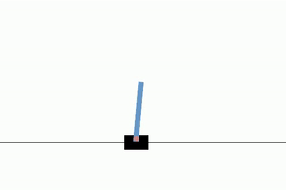

# Reinforcement Learning Baselines

The goal of this repository is to learn a little more about reinforcement learning algorithms.

<p align="center">
    
    
</p>

### Stack:
- Pytorch
- Pytorch Lightning
- TensorDict

## Getting Started

### Training

Example: To train the Reinforce algorithm, use the following command:
```
python scripts/launch.py --train --config configs/reinforce.yaml
```
You can customize the training parameters, such as the number of episodes. For example, to set the maximum number of training episodes to 500:

```
python scripts/launch.py --train --config configs/reinforce.yaml trainer.max_episodes=500
```

### Evaluation

To evaluate your models, use the same launch.py script but with the --test flag. You'll also need to specify the configuration file and the checkpoint from the outputs folder. Here’s an example:

```
python scripts/launch.py --test --config outputs/reinforce-discrete/../parsed.yaml --resume=outputs/reinforce-discrete/.../checkpoint.ckpt
```

By default, this command will print the cumulative reward for each episode. If you'd like to render the environment and save a video, add the following options:

```
python scripts/launch.py --test --config outputs/reinforce-discrete/../parsed.yaml --resume=outputs/reinforce-discrete/.../checkpoint.ckpt system.environment.render=True --save-video
```

## Contributions
We welcome contributions! If you'd like to add new features, improve documentation, or fix bugs, please create a pull request.