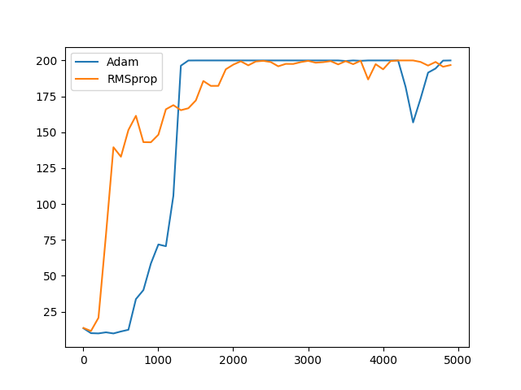
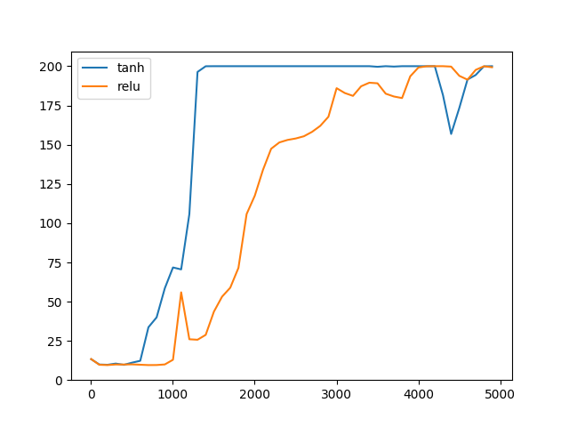

# Deep Q Learning Cart-Pole

## Architecture:

Multi-Layer Perceptron

Space State		Hidden		State Space
	4	-->	64		2

Comparison using Adam vs RMSprop optimization algorithms

Learning Rate: 0.0001
